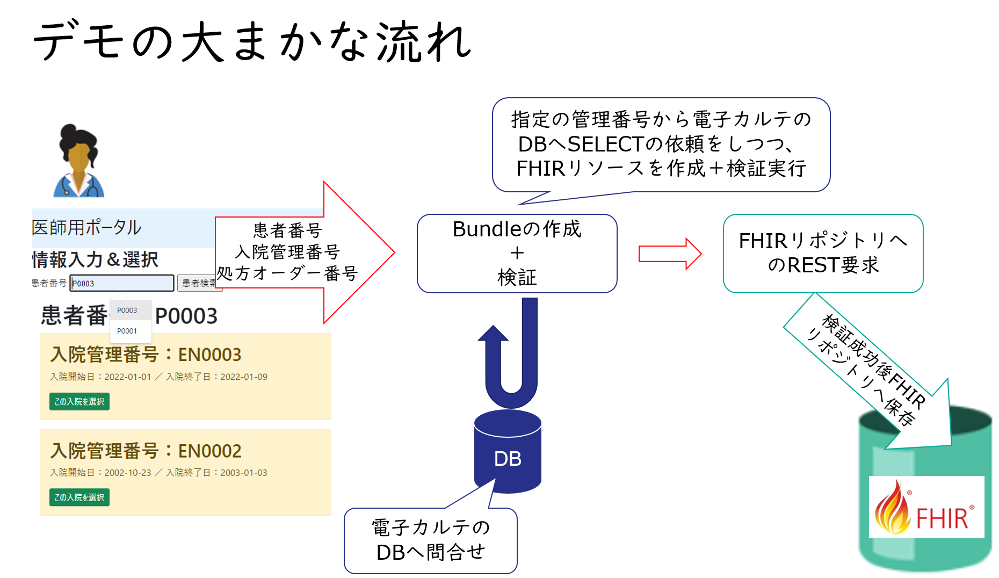
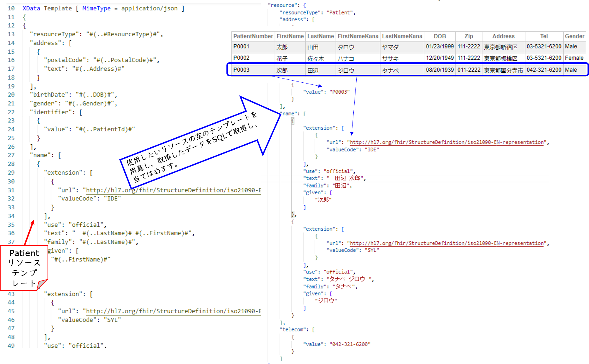

# 退院時サマリーFHIR化　サンプル

InterSystems IRIS for Health 2022.1.0 community edition を使用して、電子カルテにあるデータをSQLで抽出し、退院時サマリーのFHIR化を行うサンプルです。



## FHIR化で使用しているJSONテンプレートエンジン

作成したいFHIRリソースのJSONをテンプレート用クラス（図例はPatientリソース用テンプレートクラス）に定義します。
後は、当てはめたい情報を電子カルテのDBからSELECTで取得し、テンプレートクラスで定義したプロパティに当てはめていくだけです。



- **作成の流れご紹介**

    [JSONテンプレートエンジン](https://github.com/Intersystems-jp/JSONTemplate)を利用してリソース用テンプレートに値を割り当てる際、SELECTで取得した結果をJSON文字列として取得できているととても簡単に割り当てることができます。


    以下のJSONが[Patientリソーステンプレート用クラス](./src/FHIRTemplate/Patient.cls)で指定しているJSONです。

    ```
    {
    "resourceType": "#(..#ResourceType)#",
    "meta": {
        "profile": [ "#(..ProfileURI)#" ]
    },
    "identifier": [
        {
        "system": "urn:oid:1.2.392.100495.20.3.51.1#(..MedInstCode)#",
        "value": "#(..PatientId)#"
        }
    ],
    "name": [
        {
        "extension": [
            {
            "url": "http://hl7.org/fhir/StructureDefinition/iso21090-EN-representation",
            "valueCode": "IDE"
            }
        ],
        "use": "official",
        "text": "#(..LastName)#　#(..FirstName)#",
        "family": "#(..LastName)#",
        "given": [
            "#(..FirstName)#"
        ]
        },
        {
        "extension": [
            {
            "url": "http://hl7.org/fhir/StructureDefinition/iso21090-EN-representation",
            "valueCode": "SYL"
            }
        ],
        "use": "official",
        "text": "#(..LastNameKana)#　#(..FirstNameKana)#",
        "family": "#(..LastNameKana)#",
        "given": [
            "#(..FirstNameKana)#"
        ]
        }
    ],
    "telecom": [
        {
        "system": "phone",
        "value": "#(..Phone)#",
        "use": "home"
        }
    ],
    "gender": "#(..Gender)#",
    "birthDate": "#(..DOB)#",
    "address": [
        "#(..Address)#"
    ],
    "maritalStatus": "#(..MaritalStatus)#"
    }
    ```

    Patientリソースに情報を当てはめる際に使用しているJSON文字列の例は以下の通りです（＝SELECTで取得した結果）。

    ```
    {"PatientId":"P0003","FirstName":"次郎","LastName":"田辺","FirstNameKana":"ジロウ","LastNameKana":"タナベ","DOB":"08/20/1939","postalCode":"011-2222","text":"東京都国分寺市","Phone":"042-321-6200","Gender":"Male"}
    ```
    >IRIS以外のデータベースにある情報をSELECTする場合は、SQLゲートウェイ経由でテーブルリンクを作成すればIRISからSELECTを実行できます。SELECT時にJSON_OBJECT()関数を使用すればJSON文字列として結果を取得できます。

    JSONテンプレートに記載している **#(..プロパティ名)#** のプロパティにSELECTで取得した情報を当てはめるだけでリソース用JSONを作成できます。

    JSON文字列から1つずつ当てはめる事もできますが、より簡単に設定できるよう、JSONテンプレートエンジンでは **Patientリソース用クラスのインスタンス生成のタイミングで当てはめる事もできます。**
    
    具体的には、SELECTで取得したJSON文字列をダイナミックオブジェクトに変換し、インスタンス生成時の引数に指定するだけです。

    実際にコード例は以下の通りです。
    
    引数 in の中にJSON文字列をダイナミックオブジェクト化した情報が入ります（変数 a にJSON文字列が入っている場合、ダイナミックオブジェクト化するには、 *set in={}.%FromJSON(a)* を実行するだけです。）
    ```
    set patient=##class(FHIRTemplate.Patient).%New(in)
    set patient.Gender=$select(in.Gender="Male":1,1:2)
    set address=##class(FHIRTemplate.DataType.Address).%New(in)
    set patient.Address=address
    ```

    この他、退院時サマリの[Compositionリソース](src/FHIRTemplate/Composition.cls) には、退院時サマリで使用する他リソースへの目次ような**セクション情報**があり、決まったセクション番号と対応する文字列を指定する指示があります。
    
    IRISは、FHIRリポジトリやFHIRファサードとしての利用の他に、DBとして利用できますので、[仕様書](https://std.jpfhir.jp/stddoc/eDischargeSummaryFHIR_v1x.pdf)で指定されているコードや文字列については、IRISにテーブルを作成し登録しておくことができるので、以下のJSON作成時、JSONテンプレートエンジンとIRISのデータベースを活用することで、少ないコードで必要なFHIRリソース情報を生成させることができます。

    JSONのイメージは以下の通りです（セクション番号と対応する文字列が仕様書で指定されいます）。
    ```
    {
        "title": "入院時診断",
        "code": {
            "coding": [
                {
                    "system": "http://jpfhir.jp/fhir/eClinicalSummary/CodeSystem/document-section",
                    "code": "342",
                    "display": "入院時診断"
                }
            ]
        },
        "text": {
            "status": "additional",
            "div": "入院時の診断内容"
        },
        "entry": [
            {
                "reference": "urn:uuid:b49f6bf2-f483-11ec-afa4-0242c0a82002",
                "type": "Resource"
            }
        ],
        "section": []
    },
    {
        "title": "アレルギー・不耐性反応",
        "code": {
            "coding": [
                {
                    "system": "http://jpfhir.jp/fhir/eClinicalSummary/CodeSystem/document-section",
                    "code": "510",
                    "display": "アレルギー・不耐性反応"
                }
            ]
        },
        "text": {
            "status": "additional",
            "div": "アレルギー情報です"
        },
        "entry": [
            {
                "reference": "urn:uuid:d981dc70-f483-11ec-afa4-0242c0a82002",
                "type": "Resource"
            }
        ],
        "section": []
    },
    ```                 

    以下のコードのように、仕様書で指定されたセクション番号（342や510など）を指定するだけで上記JSONを生成しています。
    ```
    set sec342=##class(FHIRTemplate.Composition.section).%New()
    set sec342.title="入院時診断",sec342.code=342,sec342.textDiv="入院時の診断内容"
    do sec342.entry.Insert(condition)
    do sec300.section.Insert(sec342) 
        
    set sec510=##class(FHIRTemplate.Composition.section).%New()
    set sec510.title="アレルギー・不耐性反応",sec510.code=510,sec510.textDiv="アレルギー情報です"
    do sec510.entry.Insert(allergy)
    do sec300.section.Insert(sec510)
    ```

    同様にコード系の情報もコードを指定したらリソース作成時に必要となる、system、display、code、textなどの情報をDBから取り出し、リソース用JSONを生成する事もできます。
    ```
    "reasonCode": [
        {
            "coding": [
                {
                    "system": "urn:oid:1.2.392.200119.4.101.6",
                    "code": "B0EF",
                    "display": "持続腹痛"
                }
            ]
        }
    ],
    ```
    上記JSONも code を指定するだけで生成できます。
    ```
    set reasonCode=##class(FHIRCustom.CodeableConcept.ByomeiCode).GetByCode(in.ReasonCode)
    ```

- メモ
    
    Webアプリケーションから指示されたときにSQLの実行とリソースの作成を行っているクラスは[BuildResource.cls](./src/TRYDischargeSummary/DischargeSummary/BuildResource.cls) です。

    各リソースのインスタンス化を行っているクラスは[SetResourceData.cls](src/TRYDischargeSummary/DischargeSummary/SetResourceData.cls) です。

    SQLの実行を命令しているクラスは[CollectData.cls](src/TRYDischargeSummary/DischargeSummary/CollectData.cls) の **RunQuery()** で、実行しているSQL例は **SQLDummy()** メソッドに記述しています。


## サンプル開始のための事前準備

以下インストール済の環境で実行してください。

- Docker
- docker-compose
- git

## 開始手順

1. [data](./data)をVolumeマウントするための設定

    以下シェルを実行してください。

    ```
    ./setup.sh
    ```

2. コンテナビルド

    ```
    docker-compose build
    ```

3. コンテナ開始

    ```
    docker-compose up -d
    ```

    コンテナ名は、irisfacadeです。コンテナへのログインは以下の通りです。

    ```
    docker exec -it irisfacade bash
    ```

    ※ コンテナ内でirispythonコマンド（/usr/irissys/irispython）を実行すると、R4FHIRNAMESPACEに接続するように環境変数を設定しています。

    コンテナ内のログの見方
    ```
    docker-compose logs
    ```

    Flaskのアプリが起動してると、以下ようなログ（下4行）が表示されます。

    ```
    $ docker-compose logs
        ＜省略＞
    irisfacade    | [INFO] ...started InterSystems IRIS instance IRIS
    irisfacade    | 
    irisfacade    | Waited 14 seconds for InterSystems IRIS to reach state 'running'
    irisfacade    | /iris-main "$@" (wd: /opt/try)
    irisfacade    | [2022-06-27 10:34:57 +0900] [881] [INFO] Starting gunicorn 20.1.0
    irisfacade    | [2022-06-27 10:34:57 +0900] [881] [INFO] Listening at: http://0.0.0.0:5000 (881)
    irisfacade    | [2022-06-27 10:34:57 +0900] [881] [INFO] Using worker: sync
    irisfacade    | [2022-06-27 10:34:57 +0900] [883] [INFO] Booting worker with pid: 883
    ```

4. Webアプリ起動

    http://localhost:5000

    以下の番号を指定してください（他の番号では情報が足りないので指定しないでください）。

    - 患者番号：P0003
    - 入院管理番号：EN0003
    - 処方番号：ORD003

    実行後、ドキュメントとしてFHIRリポジトリに保存します。
    
    - **その他**
        
        - コンテナ外からRESTクライアントでアクセスする場合は、以下URLでGET要求を行ってください。（保存時のエンドポイント以降の情報はWebアプリの画面で表示されます）

            例）http://<コンテナホストのIP>:52779/csp/healthshare/r4fhirnamespace/fhir/r4/Bundle/1/_history/1

        - 電子カルテ用データは、ネームスペース：R4FHIRNAMESPACE のISJスキーマ以下テーブルに入っています。

        - 退院時サマリーFHIR化用ソースコードは、[DischargeSummary](./src/TRYDischargeSummary/DischargeSummary)以下に含まれています。

        - [DischargeSummary/REST](src/TRYDischargeSummary/DischargeSummary/REST) には、Webアプリから退院時サマリ作成依頼の時に利用するRESTディスパッチクラスとFHIRリポジトリへHTTP要求の実施を行うクラスが含まれています。

5. コンテナ停止

    ```
    docker-compose stop
    ```

6. コンテナ破棄
    
    ```
    docker-compose down
    ```
