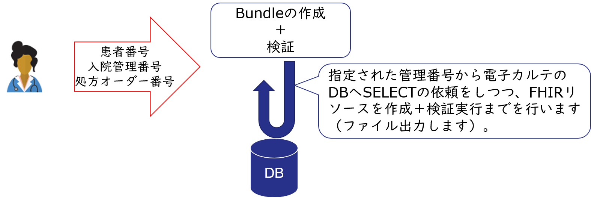

# 退院時サマリーFHIR化を試してみよう！

このディレクトリ以下では、電子カルテのDBから退院時サマリーを作成するために必要な情報を抽出し、FHIR化する流れを確認できるサンプルが含まれます。



サンプルの流れでは、患者番号、入院管理番号、処方オーダー番号を指定し、電子カルテのDBから退院時サマリー作成に必要な情報（詳細：[退院時サマリー HL7 FHIR 記述仕様](https://std.jpfhir.jp/stddoc/eDischargeSummaryFHIR_v1x.pdf)）を抽出し、Bundleリソースを作成しています。

Bundleリソース作成後、リソースの検証を行った後、BundleリソースのJSONファイルを出力しています。

## 利用前の準備
IRIS for Healthのインストールで用意されるFHIR R4リソースリポジトリ用のプロファイルの更新を行ってください。

方法は、[PDF](../../FHIRR4CurrentProfileUpdate.pdf) をご参照ください。


この他に、**JSONテンプレートエンジンとFHIRテンプレート用クラス一式のインポートが必要** です。

[src](../../src)フォルダ以下のクラス定義をインポートします。

[src](../../src) を右クリックし、[**Import Without Compililation**] を行ってください（コンパイルは別画面で行うため、一旦インポートのみ行ってください）。

コンパイルを行うため、管理ポータル、または、ターミナルを開きます（どちらかの方法でコンパイルを実施してください）。

- a) 管理ポータルでのコンパイル

    管理ポータルを開き、**システムエクスプローラ > クラス** を開き、接続先のネームスペースを指定します。

    画面左のクラス名のテキストボックスに FHIR*.cls,JSON*.cls を指定しEnterをクリックします。

    表示されるクラス（FHIRから始まる名前のクラスとJSONから始まる名前のクラス全部）を全選択し、コンパイルボタンをクリックします。

    「コンパイルフラグ」から **「依存したクラスをコンパイル」** にチェックを入れ、コンパイルをクリックします。

    依存関係の影響でエラーが出るので、「完了」ボタンをクリックし、**もう1度「コンパイル」ボタンからコンパイルを実施します。**
    
    コンパイルが正常終了したら、画面を閉じます。

    図解も参照ください。
    

- b) ターミナルで実行する場合

    IRISにログインし、対象ネームスペースに移動します。
    
    Windowsの場合は、IRのランチャーからターミナルを選択します。

    windows以外の場合は、OSにログイン後、以下コマンドでログインします。
    （session の右側の引数は構成名を指定します。）
    ```
    iris session iris
    ```

    対象ネームスペースに移動します（例はTESTネームスペースへ移動）

    ```
    set $namespace="TEST"
    ```

    コンパイルを実施します。
    ```
    do $system.OBJ.CompilePackage("JSONTemplate,FHIRTemplate,FHIRCustom,FHIRTest,FHIRFacade","cukb")
    ```
    依存関係のエラーが出るため、もう1度同じコマンドを実行します。
    ```
    do $system.OBJ.CompilePackage("JSONTemplate,FHIRTemplate,FHIRCustom,FHIRTest,FHIRFacade","cukb")
    ```


## サンプルを動かす手順

- 1) クラス定義のインポート

    [DischargeSummary](./DischargeSummary/)を右クリックし、[**Import And Compile**] を行ってください。

    [ISJ](./ISJ/)を右クリックし、[**Import And Compile**] を行ってください。


- 2) 疑似テーブルの作成

    電子カルテ内DB用テーブルとしてサンプルテーブル定義とデータを作成します。
    
    以下実行例は、ネームスペースTESTに接続しています。環境に合わせ適宜ご変更ください。
    
    ```
    set $namespace="test"
    do ##class(ISJ.Utils).init()
    ```

    作成されるテーブルは、ISJ.Patient、ISJ.Doctor、ISJ.Encounter、ISJ.MedicationRequest、ISJ.Allergy、ISJ.Condition、ISJ.CarePlan、ISJ.Organization の合計8テーブル作成されます。

- 3) 退院時サマリーFHIR化で使用するコードテーブルの一括登録

    ターミナルを開き、以下実行します。 実行例は、ネームスペースTESTに接続しています。環境に合わせ適宜ご変更ください。

    ```
    TEST>write ##class(FHIRTemplate.Util.CodeTable).GenerateAll()

    FHIRCustom.CodeableConcept.AdmitSourceのデータを登録します
    FHIRCustom.CodeableConcept.ClinicalStatusのデータを登録します
    FHIRCustom.CodeableConcept.DischargeCodeのデータを登録します
    FHIRCustom.CodeableConcept.DocSectionCodeのデータを登録します
    FHIRCustom.CodeableConcept.VerificationStatusのデータを登録します
    FHIRCustom.Coding.DiagnosisRoleCodeのデータを登録します
    正常に登録されました1
    TEST>
    ```

- 4) 病名マスターをダウンロードし、データをインポートします。

    [ICD10対応標準病名マスター](https://www2.medis.or.jp/stdcd/byomei/index.html)のページからマスターをダウンロードします。

    サンプル確認時点では、Ver 5.09 をダウンロードしています。Zipに含まれる nmain509.txt を使用してデータのインポートを行っています。
    
    ターミナルを開き、以下実行します。 実行例は、ネームスペースTESTに接続しています。環境に合わせ適宜ご変更ください。

    第1引数はダウンロードした nmain509.txt のフルパスを指定してください。
    ```
    TEST>write ##class(FHIRCustom.DB.ByomeiCode).ImportData("/home/irisowner/nmain509.txt")
    1
    TEST>
    ```


4) テスト実行を動かします。

    ターミナルを開き、以下実行します。 実行例は、ネームスペースTESTに接続しています。環境に合わせ適宜ご変更ください。

    第1引数は作成されたBundleリソースを出力するディレクトリをフルパスで指定します。

    出力ファイルは　**指定したディレクトリ/DischargeSummary-bundle.json** で出力されます。

    ```
    TEST>do ##class(DischargeSummary.BuildResource).Test("/temp")
    ```

以上です。お疲れ様でした。


    